<!-- PROJECT LOGO -->
<h1 align="center">
  <br>
  <a href="https://github.com/BotRandomness/CODE-DMG">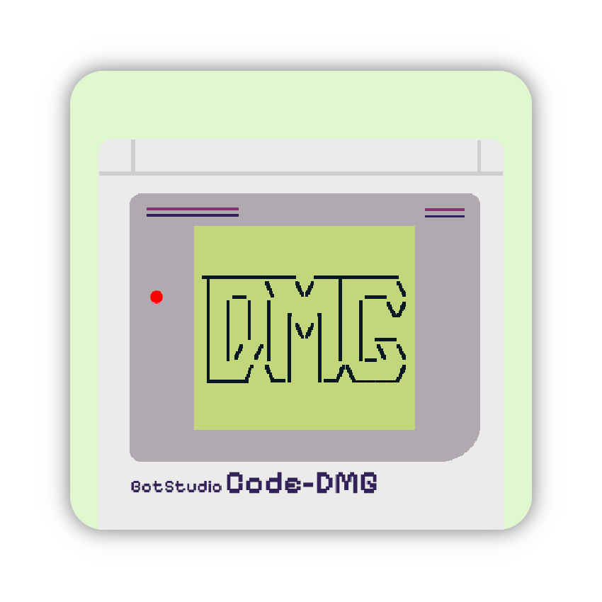</a>
  <br>
  <b>CODE-DMG</b>
  <br>
  <sub><sup><b>CODE-DMG, a Gameboy emulator, written in C#.</b></sup></sub>
  <br>

</h1>

<a href="https://github.com/BotRandomness/CODE-DMG">
    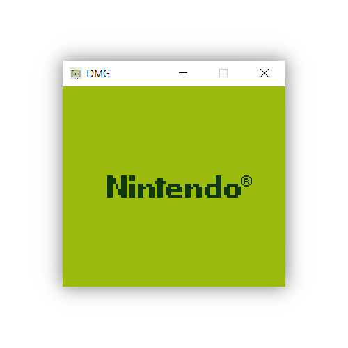
</a>

<p align="center">
<strong>CODE-DMG is a Gameboy emulator, capable of running some of the best games for the Gameboy.</strong> <em>A bit of a background:</em> With some of my recent projects being focused on emulation
  (<a href="https://github.com/BotRandomness/Flixel-8">CHIP-8</a>, <a href="https://github.com/BotRandomness/GO-8080">Intel 8080</a>), I really got into low level development. Soon after making my Intel 8080 emulator,  <a href="https://github.com/BotRandomness/GO-8080">GO-8080</a>, I wanted to emulate a system more familiar, something I had experience in. Then it hits me, "I should make a Gameboy emulator!" It's a step up from the Intel-8080, and I thought it would be <strong>perfect challenge, to learn, and to experiment.</strong> Here is a little background about the Gameboy itself <em>(As if it needs a introduction)</em>. The Gameboy was designed by <strong>Gunpei Yokoi</strong> at <strong>Nintendo</strong>, which then launched in <strong>1989</strong>. The Gameboy hardware is quite simple, but it is utilize in complex ways by games. The base hardware of the Gameboy is as follows: a <strong>8-bit CPU</strong> known as the <strong>Sharp LR35902 (SM83)</strong> <em>(also known as DMG-CPU)</em> is clocked at around <strong>4.19 Mhz</strong>, with the internal <strong>memory of 8 KB of RAM and 8 KB of VRAM</strong> with a <strong>16-bit address bus</strong>. Gameboy cartridges also have <strong>MBC chips</strong> which allows for bigger roms with addtional RAM. The Gameboy sports a <strong>PPU</strong> <em>(Picture Processing Unit, think about like the Gameboy's GPU)</em>, which is responsible of rendering on the <strong>160x144 LCD</strong> with 4 shades of green. The Gameboy's codename was <strong>DMG</strong>, <em>Dot Maxtix Game</em> (hence the name of this project), and DMG refers to display technolgy used. The Gameboy is known as one of the <strong>best gaming devices to ever release</strong>, especially how it <strong>revolutionized handheld gaming!</strong> Going back to on this emulator, I found it really fun to work on! You may be wondering, <em>"Why use C#, and not like C/C++?"</em> Well <strong>C#</strong> is one of favorite language, so why it not make my <strong>favorite project in my favorite language!</strong> You now be saying, <em>"That's cool and all, but why use Raylib-cs, and not like WinForm or something like that?"</em> Because I found Raylib for rendering graphics to be simple, with less overhead, and <strong>it's just fun! :)</strong>       
</p>

</div>

<!-- ABOUT THE PROJECT -->

## Getting Started
Want to use it, and mess around? Here's how you can get started!
### Download
1. Download it from [here](https://github.com/BotRandomness/CODE-DMG/releases), or on the releases page. (win-x64, win-x86, osx-x64, osx-arm64, linux-x64)
2. Unzip the folder
3. Open up your terminal at the download location (Can be ran with CLI only for right now) <strong> Your current working directory must be at the application location when using!</strong>
4. Optional: Place the bootrom by the executable. Bootrom file should be named `dmg_boot.bin`
5. `CODE-DMG --dmg <string:rom>`
6. You are ready to go!
### Controls
- (A) = Z
- (B) = X
- [START] = [ENTER]
- [SELECT] = [RSHIFT]
- D-Pad = ArrowKeys
### Usage
For the most basics usage: `CODE-DMG --dmg <string:rom>`. Save files are supported (experimental), a `.sav` file will be genarated in the same location as the ROM. This `.sav` file can work between emulators like BGB. Currently CODE-DMG support MBC0/ROM Only roms, as well as experimental MBC1, MBC3 (no RTC), and MB5 (no rumble).
#### Flags
CODE-DMG for now is only runnable through the CLI. Executing the executable directly will rely on the fall back rom. Note: these flags can be passed in any order, and in any combination.
- `--dmg <string:path>`, `--dmg`: Starts up the emulator given a rom file (Default mode. No rom given, fall back is default)
- `--json <string>`: Runs a CPU test for a instruction given a JSON file in test/v1
- `-b <string:path>`, `--bootrom <string:path>`: Loads custom bootrom path than default. (dmg_boot.bin is default)
- `-s <int>`, `--scale <int>`: Scale window size by factor (2 is default)
- `-f`, `--fps`: Enables FPS counter (off is default)
- `-rl`, `--raylib-log`: Enables Raylib logs (off is default)
- `-p <string>`, `--palette <string>`: Changes the 2bpp palette given name (dmg is default)
- `-a`, `--about`: Shows about
- `-v`, `--version`: Shows version number
- `-h`, `--help`: Shows help screen
#### Bootrom
The bootrom of the Gameboy is first program that is ran by the Gameboy which sets up register and memory value, and also performs a validity check on the rom. This better known as the Nintendo logo scrolling down when you power on a Gameboy. <strong>Optional, but it is recommended you provide the bootrom.</strong> It must be named `dmg_boot.bin` and be placed in root of executable. <strong>However, even without a bootrom, roms will still work.</strong>

#### Fallback ROM
The fallback rom, `fall_back.gb`, is a custom ROM I made in GBZ80 assembly as a fall back rom the emulator can run. This rom purposely has invalid header data, which if provided a bootrom, can emulate what happens when you turn on a Gameboy without a game. If a bootrom is not provided, and the fall back rom is ran, then you will see a screen with a message saying "This should not be seen on a real DMG or emu with bootrom checks"

## Screenshots
<a href="https://github.com/BotRandomness/CODE-DMG">
    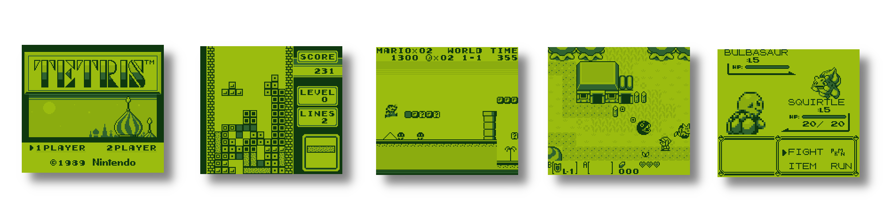
</a>
<p align="center"> Showcase of running games </p>

### Demo Gameplay
<table>
    <tr>
        <td><a href="https://github.com/BotRandomness/CODE-DMG">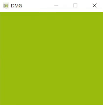</a></td>
        <td><a href="https://github.com/BotRandomness/CODE-DMG">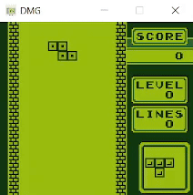</a></td>
    </tr>
  <tr>
        <td><a href="https://github.com/BotRandomness/CODE-DMG">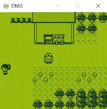</a></td>
        <td><a href="https://github.com/BotRandomness/CODE-DMG">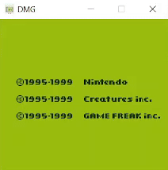</a></td>
    </tr>
  <tr>
        <td><a href="https://github.com/BotRandomness/CODE-DMG">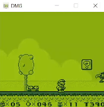</a></td>
        <td><a href="https://github.com/BotRandomness/CODE-DMG">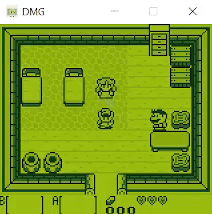</a></td>
    </tr>
  <tr>
        <td><a href="https://github.com/BotRandomness/CODE-DMG">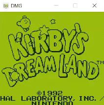</a></td>
        <td><a href="https://github.com/BotRandomness/CODE-DMG">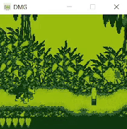</a></td>
    </tr>
</table>

### Palette Showcase
https://github.com/user-attachments/assets/3bcbf186-995e-4dc8-8f52-25cb3de8892e
<p align="center"> Pallette Names (Top Left to Bottom Right): dmg, cyber, autumn, paris, emu, coffee, grayscale, early, crow, winter </p>

## Compatibility
<a href="https://github.com/BotRandomness/CODE-DMG">
    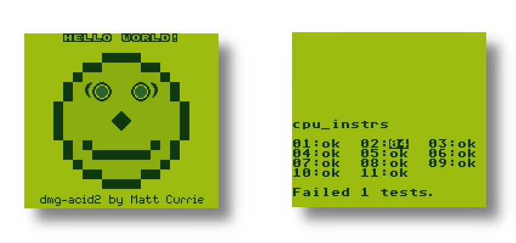
</a>
<p align="center"> dmg-acid2 passes. Blargg's cpu_instrs passes except for interrupts, which is because I didn't implement all interrupts yet </p>
When it comes to the Mooneye MBC test, MBC5 passes, and MBC1 mostly passes. <em>(I did say MBCs support is experimental)</em></break>

Pretty much every game I tried does work. Do note MBC0/ROM Only should work. MBC1, MBC3, and MBC5 should also work. I don't have a full list of games, but here is a list of games I tried:
```
Asteriods - Works
Donkey Kong Land - Works
Donkey Kong Land 2 - Works
Donkey Kong Land 3 - Works
Dr.Mario - Works
Dropzone - Works
Kriby's Dream Land - Works
Kriby's Dream Land 2 - Hangs on first frame due to unimplemented timer interrupt
Legend of Zelda, The Link's Awakening - Works
Pokemon Blue - Works
Pokemon Yellow - Works
Pokemon Gold - Works
Prehistorik Man - Playable, but graphical glitches in intro (requires accurate timing)
Super Mario Land - Works
Super Mario Land 2, 6 Golden Coins - Works
Tetris - Works
Tennis - Works
```

## Compile
Want to tinker around, modify, make your own, learn a bit about emulation development, or contribute? Here's how you can get started with the code and compile.

To get started, you need to have dontnet install. For reference, I used dotnet 6.0

1. Download dotnet: https://dotnet.microsoft.com/en-us/
2. Clone this repository, and point your terminal to the root directory of the repository
3. Run `dotnet run -- --dmg <string:rom>` to compile, and it should run right after!

Raylib-cs (the C# binding (made by Chris Dill) for Raylib), does not need to be installed, as dotnet will automatically install any dependences from NuGet. For more information on raylib-cs can be found here on Github: https://github.com/chrisdill/raylib-cs

### Build
- For your own platform, framework dependent: `dotnet publish`
- For other platform, single file, not framework dependent:</br> `dotnet publish -r <RID> --self-contained -o bulid/<RID-Name> /p:PublishSingleFile=true`
- For other platform, single file, framework dependent:</br> `dotnet publish -r <RID> --no-self-contained -o bulid/<RID-Name> /p:PublishSingleFile=true`
</br>
The reason to have both dotnet dependent or not is the file size. If the user already has dotnet, the lighter file size is the best option. If the user does not have dotnet, it's more convenient to bundle in the dotnet as self contained even if the file size is larger. It's best to put PublishSingleFile for convenience, especially for self contained dotnet as that will have 224 dll files all in the root of the executable.
</br></br>
For more see the dotnet publish documentation: https://learn.microsoft.com/en-us/dotnet/core/tools/dotnet-publish, RID: https://learn.microsoft.com/en-us/dotnet/core/rid-catalog, SingleFile: https://github.com/dotnet/designs/blob/main/accepted/2020/single-file/design.md

### Program Architechture
Here's a little information on the program layout!

Looking over the code, the program is quite simple, don't worry! This portation was written to be simple, so no matter of your skill level, anybody should get the idea of the program works, it's sort of the reason why I write these parts! :)

C# is a object oriented language. Due to this, we can represent each "component" of the Gameboy as a object. This means we have the following:
- `CPU.cs`: The 8-bit CPU of the Gameboy (Also can be know as SM83)
- `PPU.cs`: The PPU of the Gameboy, responsible for changing the mode depending on rendering state, and rendering to screen
- `MMU.cs`: The Memory Management Unit is reponsible of handling `Read()` and `Write()` to all types memory on the Gameboy, with 16-bit addressing space
- `MBC.cs`: The Memory Bank Controller chip (MBCs) on the cartridge to switch ROM banks and RAM banks to allow ROM size to be greater than 32 KB, and external RAM which be used for save data or extra working RAM
- `Joypad.cs`: Handles input for the Gameboy
- `Timer.cs`: The timer component to update timing values
- `DMG.cs`: Where we "wire up" all the componets together
- `Test.cs`: Used for JSON test for the CPU
- `Helper.cs`: Static class to hold global values
- `Program.cs`: The entry point of the emulator

Note: <strong>This not a cycle accurate emulator.</strong> Also when it comes to rendering, this is not FIFO based, but a scanline based renderer.

Each component sticks to it's task. The core of this emulator is written in plain C#, with the only outside library being raylib-cs which is used very minimally. It would be something I may do where I refactor the code to make the core more independent, which should be easy to do.

Moving on to the basic flow, in the `DMG.cs` a `Run()` methods "wires up" the compoents together as so:
```cs
public void Run() {
  ...
  while (!Raylib.WindowShouldClose()) {
    Raylib.BeginDrawing();

    int cycles = 0;
    int cycle = 0;

    joypad.HandleInput();

    while (cycles < 70224) { //70224 cycles per frame (59.73 FPS)
      cycle = cpu.ExecuteInstruction();
      cycles += cycle;
      ppu.Step(cycle);
      timer.Step(cycle);
    }
    ...
    Raylib.EndDrawing();
    }
}
```
As we can see, the main emulation loop is quite simple, having the "CPU drive". We `ExecuteInstruction()` to then pass the `cycle` taken by that instruction to both the PPU and Timer. We can also see we are tracking the number of total `cycles`, this for to keep count of cycles per frame. On the orignal Gameboy, it ran at a speed of around 59.73 FPS, which is around 70224 T-Cycles (It is important to note we are using T-Cycles, not M-Cycles) The PPU and Timer object both are tracking total cycles by themselves for their own operations. After 70224 T-Cycles, that is consider one frame done. This helps to ensure we keep the CPU and PPU and other components are in sync. We have the outer while loop to loop until closed, with raylib being set to 60 FPS. This ensures the Gameboy components are in sync, and the speed we play at feels like orignal speed. Note we can also set raylib to a fast speed, allowing a "fast forward" type feature, while the main emualtion loop of componets will still be in sync. </br> </br>
All the other components should follows their own sturucture to do it's job. For example the `CPU` will execute a instruction using the `MMU`, reading the opcode to see what instruction to do, then writing to memory if needed or handle a interrupt. The `PPU` will change between for modes `HBLANK`, `VBLANK`, `OAM`, and `VRAM` depending on the cycle count, and perform diffent task during those modes, including rendering a scanline. The `MMU` is not only responsible for reading and writing to memory, but it also houses the MMIO, which are registers stored in memory that is assigned to a specific address, for example the current horizontal line count, `LY`, is stored at `0xFF44`. Using `CPU.cs` as example, a constructor is made to set the default state of the componet:
```cs
public CPU(MMU mmu) {
  A = B = C = D = E = H = L = F = 0;
  PC = 0x0000;
  SP = 0x0000; //Boot Rom will set this to 0xFFFE
  zero = negative = halfCarry = carry = false;
  IME = false;

  this.mmu = mmu;

  Console.WriteLine("CPU init");
}
```
Notice how other component can rely on others, and how they need to be passed in. In this case of the CPU, the MMU is passed in, as many insturction need to access to the memory. Each component then had the "main" method they would be invoking. For PPU and Timer it's called `Step()` as we step every cycle passed in. For the CPU, we have `ExecuteInstruction()`:
```cs
(A little snippet...)
private byte Fetch() {
  return mmu.Read(PC++);
}

public int ExecuteInstruction() {
  ...
  byte opcode = Fetch();
  switch (opcode) {
    case 0x00:
      return NOP();
    case 0x01:
      return LD_RR_U16(ref B, ref C);
  ...

private int LD_RR_U16(ref byte r1, ref byte r2) {
  r2 = Fetch();
  r1 = Fetch();
  return 12;
}
```
Each component works it small parts, emulating the behavior the Gameboy. Looking though each part, it should be easy enough to follow along.

## Credits/Resources
CODE-DMG wouldn't be possible without these resources:
- PanDocs: https://gbdev.io/pandocs/
- Gbops - The Gameboy Opcodes: https://izik1.github.io/gbops/
- Wheremyfoodat's logs: https://github.com/wheremyfoodat/Gameboy-logs
- SingleStepTest JSON Test SM83: https://github.com/SingleStepTests/sm83
- Rodrigo Copetti's GameBoy Architecture A Practical Analysis: https://www.copetti.org/writings/consoles/game-boy/

These documentations were so useful, I recommend anyone to use them!
Also shoutout to the EmuDev community! 

## Upcoming Features
- [ ] Debugger
  - VRAM viewer, Memory viewer, step mode
- [ ] Add MBC2, MBC6, and MBC7
- [ ] Serial port
- [ ] UI
  - Maybe with raygui
- [ ] Audio
- Post any feature request in the Issues tab!

## Known issues
- [ ] Finish up interrupts
- [ ] Finish up timers
  - `TIMA`, `TMA`, and `TAC`
- [ ] Fix up MBC1
  - Banking mode
- If you find other bugs/issues, open up a issue in the Issue tab

## Remarks
Working on this emulator has been a fun project, to learn about low level system development, and to experiment. I hope this repository can be used by future Gameboy emulation developers as a reference if they get stuck on something. I tried to keep to code as simple and clear as possible, and hope it can help someone else in the future :) </br>

If you are starting out making a Gameboy emulator, this is path I did that worked out for me. To get a base minimum Gameboy system running, I went for running the bootrom. The bootrom is one of the simplest Gameboy program to run. The bootrom only uses 49 opcodes, which is like around 25 general functions (depending how you implement it), and setting a stopping point at `PC:0x100` as that's where the bootroms ends and a ROM would take over. I used [wheremyfoodat's bootrom log](https://github.com/wheremyfoodat/Gameboy-logs) to make sure my bootrom logs matched up with theirs. This allows you set up your base CPU and MMU, and then a PPU with background rendering. This sets up your base emulation system, while having a Gameboy program running and rendering! Then I moved on to focus on the CPU with JSON. Persoanlly, I found it easier to do the JSON test per CPU instruction, than run the Blargg test roms first. Setting up the JSON test is quite easy, just load the register and memory value of the before state in the JSON file, run the instruction, then compare your registers and memory values in the after state in the JSON file. Doing the JSON test is pretty easy and should catch most of the bugs. <em>(Also note the JSON test assume you have a flat 64 KB array, so in my MMU I has 2 modes: One for regular Gameboy operation, and a simple mode for JSON Test)</em> Once the CPU is done, I ran the Blargg individual CPU tests, and pass all of them but one, the `SBC` instruction (Not including interrutpts). Even though the JSON test didn't catch this bug in my `SBC` instruction, it was a really simple zero flag fix I had to do. Then I moved on the PPU using [dmg-acid2](https://github.com/mattcurrie/dmg-acid2) to finish up the PPU. When it comes to interrupts, the only thing needed for most ROMS to run is VBLANK interrupt, and the LCD interrutpt, which is needed to get dmg-acid2 rendering right (It uses the LYC==LY coincidence interrupt). After that, pretty much all MBC0/ROM Only ROMs worked. Then I moved to making the MBCs, which currently I have MBC1, MBC3, and MBC5. I hope reading this little snippet remark and looking through this repository was helpful to someone developing thier own Gameboy emulator. Of course, for the best detailed information, [PanDocs](https://gbdev.io/pandocs/) is really useful. Thank you for reading!  
```
 __________________
|-|--------------|-|
|  ______________  |
| |  __________  | |
| | |          | | |
| |·|          | | |
| | |          | | |
| | |__________| | |
| |_____________/  |
|   _  GAMEBOY     |
| _| |_         () |
||_   _|       ()  |
|  |_|             |
|       / /   \\\ /
|________________/
Bot Randomness

^ ASCII Gameboy art I made myself
Free to use. If used, credit is not needed, but is appreciated :)
```

## Contributing

This project is open-source under the MIT License, meaning your free to do what ever you want with it. This project is freely available for anyone to contribute, emulations experts, Nintendo fans, Gameboy lovers, retro enthusiast, or someone who is new to it all.

If you plan on contributing, a good place to start is to look at upcoming wanted features, and known issues. If you find a new bug, or have feature ideas of your own, posted first to the Issues tab before hand. You can even fork it and make it your own! </br>

To get started on contributing:

1. Fork or Clone the Project
2. Once you have your own repository (it can be a public repository) to work in, you can get started on what you want to do!
3. Make sure you git Add and git Commit your Changes to your repository
4. Then git push to your repository
5. Open a Pull Request in this repository, where your changes will be look at to be approved
6. Once it's approved, it will be in a development branch, soon to be merge to the main branch

<!-- LICENSE -->

## License

Distributed under the MIT License. See `LICENSE` for more information.
